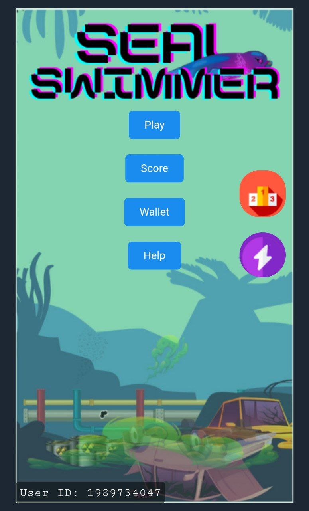
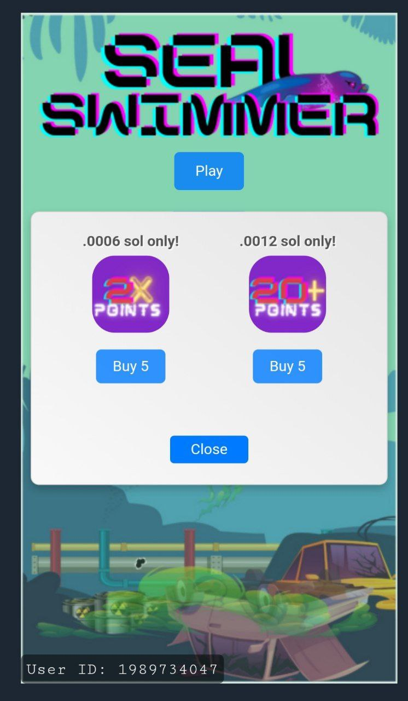
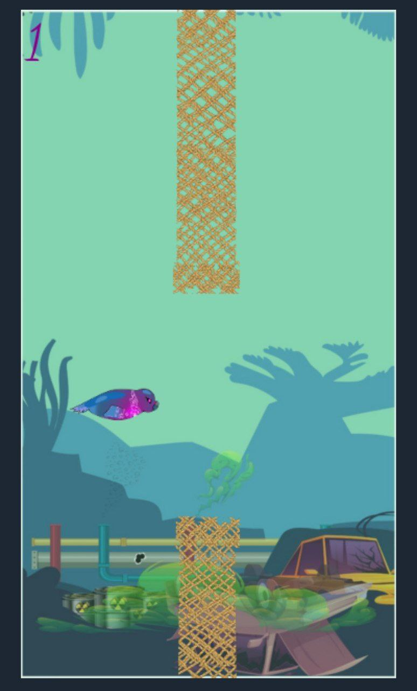

## Contact Me

## Brief 📖
I made this as a airdrop project for a crypto token launch on solana chain.
This is a hybrid version of Flappy-bird.Included: Score management on db, ingame buying, leaderboard,scoreboard

## Gallery

Here are some photos from my Game:

  
  
  

## Features 📋
⚡️ Easy to play\
⚡️ Valid java-css-html\
⚡️ Leaderboard\
⚡️ Scoreboard\
⚡️ Power-ups\
⚡️ In-game-topup with sol token

## Installation & Deployment 📦
- Clone the repository .
- In `bot.js` put yout bot-token and your site.
- In `sealswimmer.js` Put your endpoint api for database management!
- Run the Bot! thats it!!

## Tools Used 🛠️

